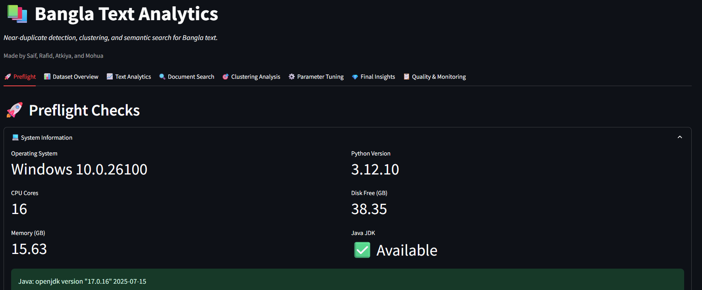

# Bangla Text Analysis (Streamlit + PySpark)

A Streamlit app for Bangla text analysis (EDA, ANN/LSH similarity search, clustering) powered by **PySpark**.



**Repository:** https://github.com/saifkhancse/Bangla-Text-Analysis

---

## 🚀 Quickstart (TL;DR)

```bash
# 1) Clone
git clone https://github.com/saifkhancse/Bangla-Text-Analysis.git
cd Bangla-Text-Analysis

# 2) (Optional but recommended) Create a venv
python -m venv .venv
# Windows
.\.venv\Scripts\Activate
# macOS/Linux
# source .venv/bin/activate

# 3) Install requirements
python -m pip install -U pip
pip install -r requirements.txt

# 4) Run the app
streamlit run app.py
```

If the default port is busy: `streamlit run app.py --server.port 8502`

> Note: Put `home.png` in the project root so the screenshot renders on GitHub.

---

## 📦 Prerequisites
- **Python** 3.8–3.12 (3.10+ recommended)
- **Java JDK** 11 or 17 (required by PySpark 3.5.x)
- **Git** (optional if you download ZIP)

**Set `JAVA_HOME` if needed**

- **Windows (PowerShell)**
  ```powershell
  $env:JAVA_HOME="C:\Program Files\Eclipse Adoptium\jdk-17"
  $env:PATH="$env:JAVA_HOME\bin;$env:PATH"
  ```
- **macOS**
  ```bash
  export JAVA_HOME="$(/usr/libexec/java_home -v 17)"
  export PATH="$JAVA_HOME/bin:$PATH"
  ```
- **Ubuntu/Debian**
  ```bash
  sudo apt-get update && sudo apt-get install -y openjdk-17-jdk
  export JAVA_HOME="/usr/lib/jvm/java-17-openjdk-amd64"
  export PATH="$JAVA_HOME/bin:$PATH"
  ```

---

## 🧭 Project Structure (convention)
```
Bangla-Text-Analysis/
├─ app.py
├─ requirements.txt
├─ home.png                # screenshot used in README
├─ work/
│  ├─ data/                # put your raw/clean data here
│  ├─ data_clean/          # parquet outputs (frozen base)
│  └─ models/              # saved TF-IDF/LSH models
└─ outputs/                # figures, tables, reports
```

> Paths are configurable from the app UI. If a path is missing, the app will prompt you.

---

## 🔎 Detailed Workflow

### 1) Data Ingestion
- Load raw documents (e.g., JSONL/CSV) into **Spark** DataFrame.  
- Standardize schema: `doc_id`, `text`, optional `category`, `timestamp`, `source`.
- **Freeze base**: write a canonical parquet dataset under `work/data_clean/base_*` for reproducibility.

### 2) Text Cleaning & Normalization (Bangla-aware)
- Lowercasing, punctuation/extra-space cleanup, basic Bangla digit/letter normalization.
- **Stopwords**: configurable list (includes Bangla pronouns, particles; can append single letters & digits).
- Optional: minimum token threshold filter (e.g., `min_tokens = 20`).

### 3) Feature Engineering (two tracks)
**A) TF‑IDF (for clustering & search)**
- Tokenize → `HashingTF` (`HASH_DIM`, e.g., 2048) → `IDF(minDF)` → `Normalizer(L2)`  
- Persist TF‑IDF model if desired for reuse.

**B) Binary n‑grams (for MinHashLSH)**
- Generate **character n‑grams** (e.g., `n ∈ {2,3}`) → binary vectorization.
- Fit **MinHashLSH** with `H` hash tables (e.g., 8/16/24).

### 4) EDA Dashboard
- Corpus size & category distribution.
- Token/character length histograms.
- Top **n‑grams** (unigram/bigram/trigram) with frequencies.
- Duplicate/near‑duplicate indicators and document age timeline.

### 5) Approximate Nearest Neighbors (ANN) / Similarity Search
- **MinHashLSH** over binary n‑gram space to approximate **Jaccard** similarity.
- User‑tunable params: `n` (n‑gram), `H` (hash tables), **distance threshold** (1‑Jaccard), sample fraction, max sample size.
- Returns **top‑k nearest neighbors** with similarity scores; supports category filters.

**Weak “gold‑standard” pairs for tuning**
- The app can discover **weak gold standard pairs** (heuristic near‑duplicates) to sanity‑check thresholds (e.g., title‑normalized matches, high token overlap).  
- If too few pairs are found, results may be unstable; adjust thresholds or sample size.

### 6) Clustering (K‑Means)
- Use TF‑IDF features; optionally apply **PCA** (e.g., 100 comps) before K‑Means.
- **K‑selection** supported via:
  - **Elbow** (inertia)
  - **Silhouette** (cosine)
  - **GME** (generalized metric of evaluation) summary across a grid of K (e.g., 2–20)
- Visualizations:
  - Score‑vs‑K plots (Elbow/Silhouette/GME)
  - Optional **UMAP** projection (driver‑side sample) for 2D cluster scatter
- Outputs: per‑cluster top terms, cluster size table, interactive scatter with cluster filtering.

### 7) Quality & Monitoring
- **Artifacts overview** tab shows presence, size, and last‑modified of key assets:
  - Frozen base parquet, saved models, cached figures, etc.
- Helpful messages for common issues (missing paths, cache rebuilds).

### 8) Streamlit UX
- **Tabs/Pages** (typical layout):
  1. **Home**: overview & dataset picker (shows this README image)
  2. **Data**: load/preview, path configuration, freeze base
  3. **EDA**: distributions, top n‑grams, duplicates
  4. **ANN / Search**: parameters, nearest neighbors, weak gold checks
  5. **Clustering**: TF‑IDF/PCA, K‑grid evals, UMAP, per‑cluster insights
  6. **Quality & Monitoring**: artifact status, logs, hints
  7. **Settings**: caching, thresholds, sample sizes
- Parameters exposed via sliders/selects with progress bars & status messages (so work isn’t hidden in the console).

### 9) Caching & Performance Notes
- Expensive builders are cached with `@st.cache_resource` / `@st.cache_data`.
- For unhashable args like `SparkSession` or `DataFrame`, prefix with `_` (e.g., `_spark`, `_sdf`) in cached function signatures to avoid hashing errors.
- Use sampling knobs for quick iteration; increase fractions for final runs.

---

## 🧰 Commands & Usage

### Clone or Download
```bash
git clone https://github.com/saifkhancse/Bangla-Text-Analysis.git
cd Bangla-Text-Analysis
# (or download ZIP and unzip, then cd into the folder)
```

### Create & Activate a Virtual Environment
**Windows (PowerShell)**
```powershell
python -m venv .venv
.\.venv\Scripts\Activate
python -m pip install -U pip
```
**macOS / Linux**
```bash
python3 -m venv .venv
source .venv/bin/activate
python -m pip install -U pip
```

### Install Requirements
```bash
pip install -r requirements.txt
```

### Run the App
```bash
streamlit run app.py
```
Open the terminal URL (usually http://localhost:8501).

---

## 📄 Data Notes
- Place your input files under `work/data/` (or point the UI to your data location).
- If you see `PATH_NOT_FOUND`, update the path in the UI or move files to the suggested folder.
- First run may build caches/models and take longer.

---

## 🪪 License
See `LICENSE` in the repository (if provided).

---

## 🆘 Troubleshooting
- **PySpark/Java error** → verify **Java 17** is installed and `JAVA_HOME`/`PATH` set (see above).
- **Port in use** → run `streamlit run app.py --server.port 8502`.
- **Missing session state key** → restart the app after first-time setup or re‑initialize via the **Settings** tab.
- **Slow first run** → lower sample fraction; reduce `K` grid; disable UMAP for quick tests.
